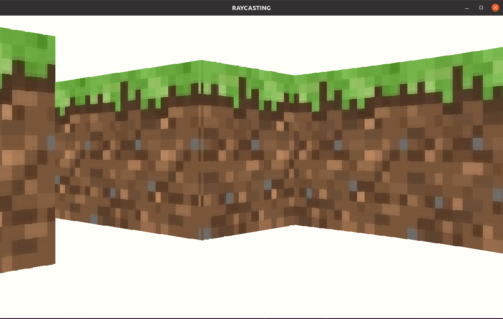
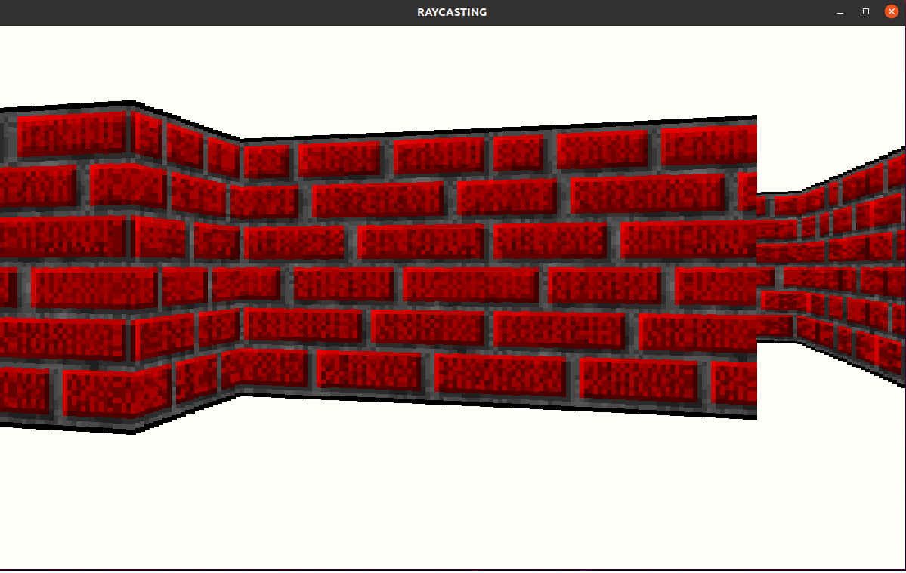

# Raycaster_v2

[](https://svgshare.com/i/Zhy.svg)


Ce projet consiste à mettre en place un moteur de jeu inspiré par Wolfenstein 3d et DOOM.
Le moteur 3D est basé sur la technique du raycasting qui permet d'afficher un environnement 3D à partir d'affichage 2D.
<br>
Il s'agit d'une évolution de mon [premier moteur de raycasting](https://github.com/Rudiio/Raycaster.git) qui permettait un affichage 3D sans optimisation.


## Objectifs

- [x] Mettre en place les calculs de distances optmisés (merci la trigo)
- [x] Afficher l'environnement 3D
- [x] Gérer la minimap
- [x] Texturer les murs
- [ ] Textures le sol
- [ ] Texturer le plafond
- [ ] Afficher des sprites


## Dependencies

### SDL Library
Le projet utilise la Bibliothèque graphique [SDL2](https://www.libsdl.org/download-2.0.php).
Son API permet de facilement gérer les affichages ainsi que E/S.
L'extension SDL_image est utilisée pour gérer l'imporation des textures.

Sous Linux : 

```
sudo apt install libsdl2-2.0-0 libsdl2-gfx-1.0-0 libsdl2-image-2.0-0 libsdl2-mixer-2.0-0 libsdl2-net-2.0-0 libsdl2-ttf-2.0-0 libsdl2-dev libsdl2-image-dev
```

## Avancée du projet<br>

### Sans texture


### Avec la texture d'herbe de Minecraft


### Avec la texture de Wolfenstein
